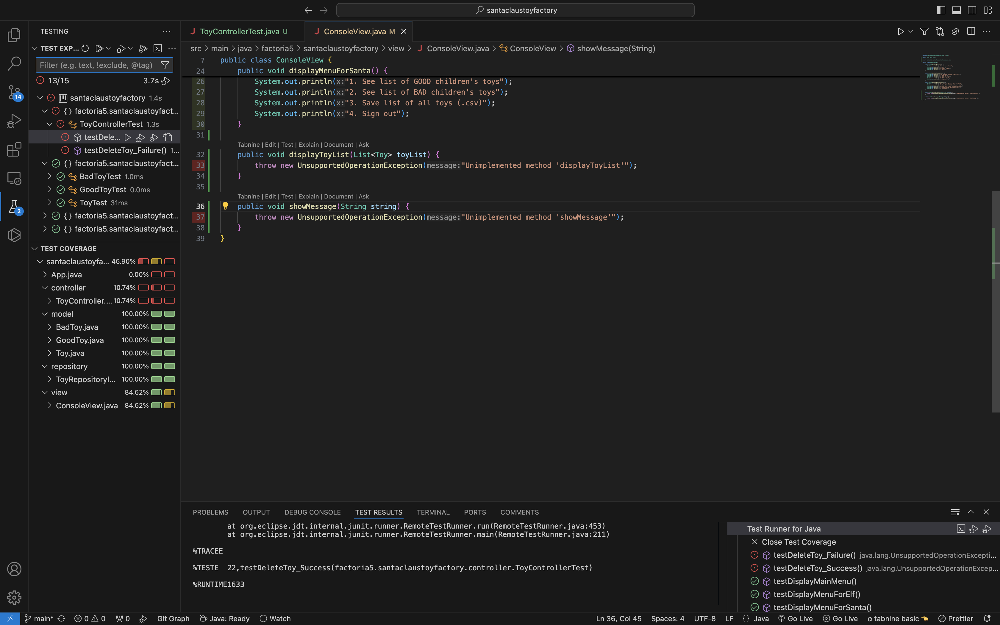
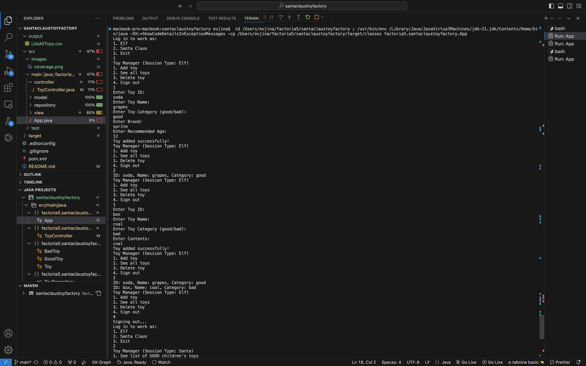
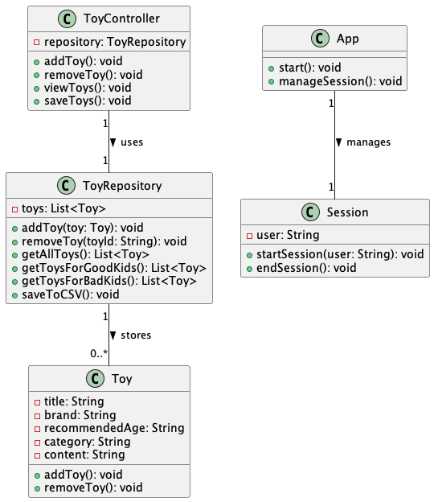
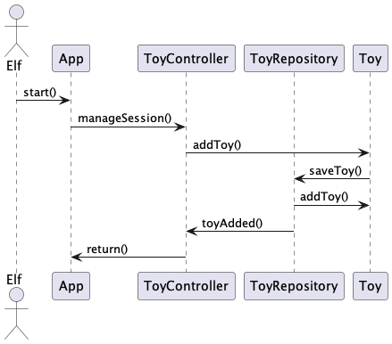

# Project - Santa Claus Toy Factory

# Description
has commissioned the creation of a console application that will allow Santa's elves to log the toys created, list the inventory, and delete toys.
If the application is used by Santa then he will be able to get the list of toys for good children or the list of toys for bad children.
Apply the MVC (Model-View-Controller) architecture pattern to structure the application. Understand and apply the repository pattern and dependency inversion.

# Prerequisites
To run this project, you need to have the following programs installed:

Java 21 or higher (JDK)
Maven (for dependency management and project execution)
JUnit 5 (for unit test execution)

# Installation 
First, you need to go to my repository page in Ginhub: https://github.com/vyushkevich/ProjectSantaClaus

Then use the command "git clone https://github.com/vyushkevich/ProjectSantaClaus.git" in the VSC terminal

# Test coverage and showcase

# Giagrams

# Authors
Volodymyr Yushkevich
[![GitHub]
(https://github.com/vyushkevich)